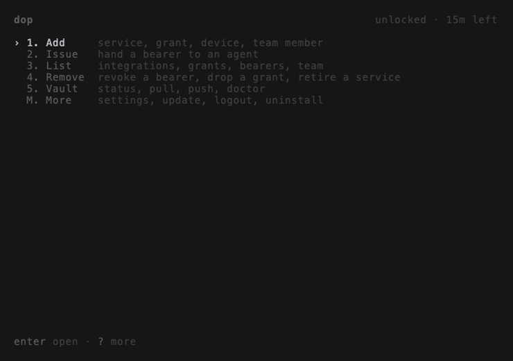

<!--
  DRAFT — TUI-first README (bd dop-wbp, plan _rules/_plans/readme-tui-first-landing.md).
  Lives next to the GIFs so they render in preview. When approved, move to the repo
  root and rewrite paths: out/… → docs/media/out/…, ../… → docs/….
  Recorded GIFs: issue, bearers. 🎬 blocks = not recorded yet.
-->

# DOP — Doors of Perception

**1Password for your AI agents.** Give each agent a scoped, revocable slice of
your team's API keys. The raw keys never leave the vault.


```bash
brew install git sops cloudflared
curl -fsSL https://raw.githubusercontent.com/untoldecay/dop/main/scripts/install.sh | bash
dop
```

`?` shows every key, `esc` goes back. That's the learning curve.

---

### Store your keys once

Add Notion, GitHub, Linear… to an encrypted vault in a private git repo you own.
No server, no account.

> 🎬 *GIF 1 — Add › Integration → Notion → paste a key → probe ✓*

CLI: `dop integration add` · [Onboarding →](../01-onboarding.md)

### Give an agent only what it needs

Pick grants (`notion.read`, `github.write`), set an expiry, issue. DOP writes
the message to paste into the agent's chat.

> 🎬 *GIF 2 — grant picker: space toggles, the env-prefix collision warning
> flashes, then resolves*

CLI: `dop token issue` · [Recipes →](../RECIPES.md)

### Approve from your phone

The agent shows a QR code. Scan it, type your approval passphrase, done.
Nothing to install on the phone.

> 🎬 *GIF 3 — terminal QR next to the phone's passphrase form*

[How pairing works →](../04-secure-elements.md)

### See and revoke everything

Every bearer, what it can reach, when it expires. Revoke takes effect on the
agent's next call.



CLI: `dop token list` · `dop token revoke` · [Threat model →](../05-threat-model.md)

### Bring your team

Invite a teammate; they join whenever they're ready. Approve them from the
Team tab.

> 🎬 *GIF 5 — More › Team › invite → Pending → `a` approve*

CLI: `dop team invite` · [Teams →](../02-teams.md)

### Works with your harness

Claude Code skill + `/dop-use`, plus Codex, opencode, Cursor and plain shells.

CLI: `dop skill install` · [Agents & harnesses →](../03-agentic-hubs.md)

---

### When not to use DOP

Need SOC2 audit retention, central RBAC or hundreds of agents? Use Vault,
Doppler or Infisical. DOP is for the gap between "paste the token in chat" and
"run a Vault cluster for five people".

### Docs

[Features](../00-features.md) ·
[Onboarding](../01-onboarding.md) ·
[Teams](../02-teams.md) ·
[Harnesses](../03-agentic-hubs.md) ·
[Secure elements](../04-secure-elements.md) ·
[Threat model](../05-threat-model.md) ·
[CI / headless](../06-ci-headless.md) ·
[CLI reference](../07-cli-reference.md) ·
[Recipes](../RECIPES.md)

Updates: `dop update` (or More › Update) · [Releases](https://github.com/untoldecay/dop/releases)
