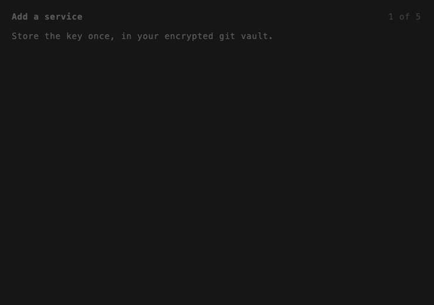

<!--
  DRAFT — TUI-first README (bd dop-wbp, plan _rules/_plans/readme-tui-first-landing.md).
  Lives next to the GIF so it renders in preview. When approved, move to the repo
  root and rewrite paths: out/… → docs/media/out/…, ../… → docs/….
  Re-record the tour: docs/media/record.sh tour
-->

# DOP — Doors of Perception

**An open-source 1Password for the AI era.** Your team and its AI agents work on
the same tools — without anyone pasting a key into a chat.

People and AI agents now work side by side. To be useful, they need the same
context: the team's docs, tickets, code and conversations. That context lives in
a dozen tools, each behind its own key. So the keys travel — pasted into AI
chats, DMed to teammates, "I'll change them later…". They rarely are.

DOP gives the team one vault for those keys, and gives every agent its own pass
to exactly the tools it needs.

## In practice

Alice connects Notion and Linear. Bob connects GitHub. They share one vault.

Now either of them can give any agent access to any of those tools — not just
the ones they added themselves. Alice's research agent reads Bob's GitHub repos.
Bob's release agent reads Alice's Linear tickets and writes the changelog in
Notion. Nobody ever sends anyone a password.

The team pools its tools once; every agent works from that shared context,
**bridging** what used to sit in separate places — with only the access it
needs, and lost in seconds when it's done. The agent never even sees the keys:
DOP hands them straight to the tool when the agent uses it, never into the
conversation.



## Try it

```bash
brew install git sops cloudflared
curl -fsSL https://raw.githubusercontent.com/untoldecay/dop/main/scripts/install.sh | bash
dop
```

Everything happens in that one screen. Press `?` to see what each key does,
`esc` to go back.

## What it does

**One place for your team's keys.**
You add a tool once — paste its API key, and it's stored locked (encrypted). The
vault is a private repository your team already owns, like a shared folder only
your team can read. No new account, no server to run, nothing sent to us.

**Each agent gets only what it needs.**
Instead of handing an agent your real key, you give it a pass: "read Notion, post
to Slack, for 3 days". The agent can use those tools and nothing else. When the
pass expires, it stops working on its own.

**Change your mind any time.**
Give an agent one more tool, or take one away, without starting over. Or cancel
its pass entirely — it stops working on its very next try.

**Approve new agents from your phone.**
When a new agent asks for access, it shows a QR code. Scan it with your phone,
type your approval code, done. Nothing to install on the phone.

**Made for small teams.**
Invite a teammate; they join when they're ready and you let them in. If two of
you change things at the same time, DOP combines both — it only asks when you
both changed the very same thing.

**Works where your agents already live.**
Claude Code, Codex, Cursor, plain terminal windows — and shared workspaces where
people and agents talk in the same rooms, like Buzz.

**Prefer typing commands?** Every action on screen is also a `dop` command, for
scripts and servers.

## When not to use DOP

Running a large company with hundreds of agents, strict audit requirements or a
security team? Use Vault, Doppler or Infisical. DOP is for small teams who are
past "paste the key in the chat" but don't want to run security infrastructure.

## Learn more

The docs use DOP's own words: a **credential** is a stored key, a **grant** is a
named slice of it ("read Notion"), a **bearer** is the pass an agent holds.

- [Features](../00-features.md) — everything DOP does, in detail
- [Getting started](../01-onboarding.md) — install, first vault, first agent
- [Teams](../02-teams.md) — sharing, invites, a lost laptop
- [Agents & tools](../03-agentic-hubs.md) — Claude Code, Codex, Cursor, shared rooms
- [How agent identity works](../04-secure-elements.md) · [What DOP protects (and doesn't)](../05-threat-model.md)
- [Servers & CI](../06-ci-headless.md) · [Every command](../07-cli-reference.md) · [Recipes](../RECIPES.md)

Updates: `dop update` (or More › Update in the app) · [Release notes](https://github.com/untoldecay/dop/releases)
